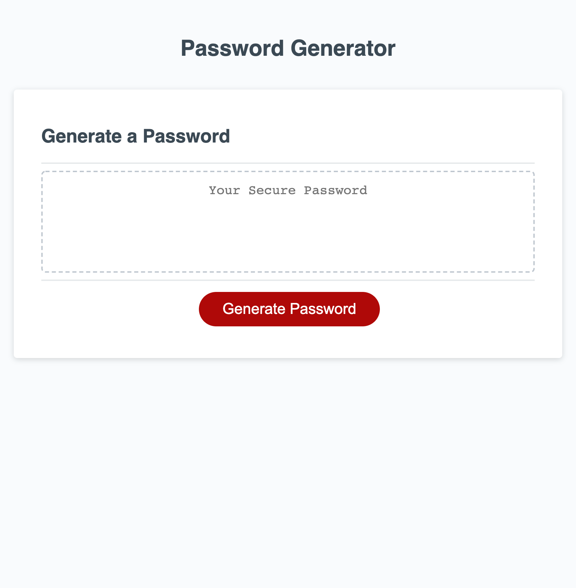

# Password Generator 🔐

## Description

Accounts are hacked into and privacy is compromised on a daily basis. For that reason it is increasingly important that people create passwords that do not follow any patterns and are hard to guess. I created a tool that would randomly generate a password for its users so that their accounts are gauranteed higher protection. This password generator allows you to choose how many characters you would like your password to contain and whether or not you would like it to include lowercase, uppercase, numeric and/or special characters.

## Screenshot

 

## Link

https://kelseybrianne.github.io/password-generator/